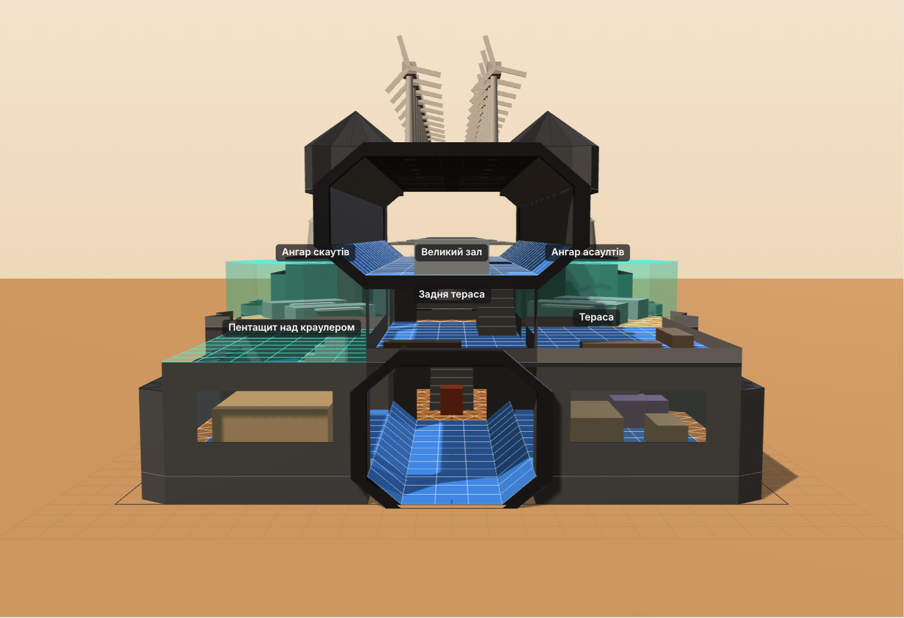

# Цитадель Харконненів — база для Dune: Awakening

Проєкт бази на **6 ділянок 10×10** з будівельних елементів Харконненів.
Використано **тільки квадратні й трикутні плити**. Повороти на 30° зроблено так само, як у грі:
квадрат → трикутник → повернутий квадрат.

Відкрий `index.html` у браузері. Там є план по рівнях у стилі скріна 1 і 3D-модель:
її можна обертати, перемикати поверхи і дивитися «лише цей поверх».

## Версія 2


Ділянки стоять сіткою **2 × 3** (20 плит завширшки, 30 углиб), як на першому скетчі.

- **Великий зал** у центрі — шестикутник 5-3-3-5-3-3 з трикутників (скрін 4), 8 рівнів у висоту, галерея на +5, парадні сходи.
- **Ангари скаутів і асаултів** прикріплені до залу і виходять уперед під 30°. Фронт 4 плити, закруглення по 2, далі рівні боки (скрін 1).
  Виліт спереду, з боків і вгору: стіни й дах — пентащит.
- **Центральний заїзд** 3 + 2 плити, заокруглений знизу і зверху (скрін 3). Гаражі відкриваються тільки в заїзд, похилі плити — пандуси.
- **Гараж краулера** зі стелею-пентащитом 6×9: грузовий 4×9 спускається і забирає краулер.
- **Балкон** над заїздом, під наскрізним ангаром.
- **Наскрізний ангар** для двох грузових з восьмикутним перерізом і рамками порталів (скрін 5), над балконом і залом.
- **Задня частина** не коробкою: округлені краї з трикутників, дахи з уступом, «ніс» складу, дві башти обабіч виходу з ангара.



### Рівні

| Рівень | Що там |
|---|---|
| 0 | Заїзд, гаражі (+1), водний блок, фабрикатори, Великий зал, склади піску й руди, головний склад, зал меланжу, рудний цех, башти |
| +5 | Ангари, балкон, тераса, перехід, галерея залу, передні й задні майданчики, задня тераса, майстерня техніки |
| +8 | Наскрізний ангар, дахи корпусів із вітропастками |
| +12 | Дах наскрізного ангара з 20 вітряками, ліхтарі башт до +14,5 |


### Як ходити базою

- **Земля.** Вулиця → заїзд → пандуси в гаражі. Заїзд → центральний вхід → Великий зал → водний блок, фабрикатори, склади → зал меланжу, рудний цех, башти → задній вихід.
- **З землі на +5.** Сходи в кожному гаражі виходять на перехід і терасу. Парадні сходи залу ведуть на галерею. Башти — з будь-якого рівня.
- **+5.** Одне кільце: перехід ↔ балкон ↔ тераса ↔ ангари ↔ галерея ↔ задні майданчики ↔ задня тераса ↔ башти ↔ майстерня.
- **+8.** Сходи з балкона через люк у наскрізний ангар між двома грузовими. Із башт — двері в кінці ангара і виходи на дахи корпусів.
- **+12.** Башти → ліхтарі → дах наскрізного ангара з вітряками.

## Розміри

- Грузовий 4×9, великий рудний переробник 3×2 заввишки до 2 — з уточнень.
- Великий переробник спайсу 3×2, 5 стін; зал меланжу має 8 рівнів.
- Скаут ≈ 3,6×2,5, асаулт ≈ 4×2,7; ангари 3 рівні.
- Краулер ≈ 7×3,5, багі 3×2, піскоцикл 2×1.
- Вітряк і вітропастка займають місце 2×2, над ними нічого немає.

**Перевірити в грі:** чи заїжджає техніка на похилу плиту висотою 1 рівень і чи проходить грузовий крізь горизонтальний пентащит.

## Структура

| Файл | Призначення |
|---|---|
| `index.html` | Сторінка: план, 3D, легенда, кошторис плит, маршрути |
| `src/model.js` | Геометрія бази: приміщення, плитки, прорізи, сходи, обладнання. Правки дизайну вносяться сюди |
| `src/plan2d.js` | 2D-план (SVG) і підрахунок плит |
| `src/view3d.js` | 3D-модель (three.js r128) |
| `src/app.js` | Інтерфейс сторінки |
| `tools/check-model.js` | Перевірка: межі ділянок, перекриття плиток, техніка в приміщеннях |
| `tools/render.js` | Знімки в `renders/` (Playwright) |
| `tools/build-artifact.js` | Збирає сторінку для публікації |

```sh
node tools/check-model.js
NODE_PATH=$(npm root -g) node tools/render.js
```
