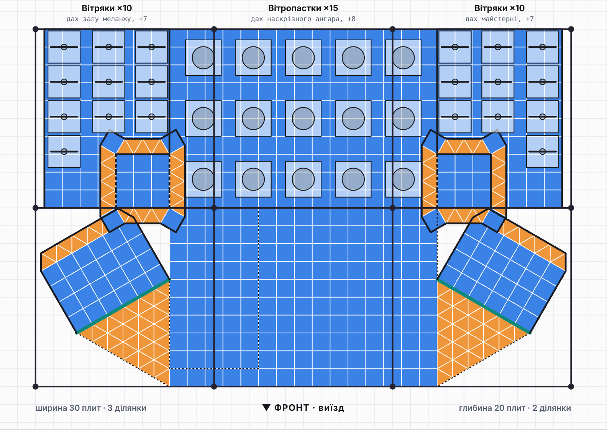

# Цитадель Харконненів — база для Dune: Awakening

Проєкт бази на **6 ділянок 10×10** з будівельних елементів Харконненів.
Використано **тільки квадратні й трикутні плити**. Повороти на 30° зроблено так само, як у грі:
квадрат → трикутник → повернутий квадрат.

Відкрий `index.html` у браузері. Там є план по рівнях у стилі скріна 1 і 3D-модель зі зрізом по висоті.


## Компоновка

Ділянки стоять сіткою **3 × 2** (30 плит завширшки, 20 углиб). Фронт потребує 30 плит:
ангар 7,5 + гараж 5 + заїзд 5 + гараж 5 + ангар 7,5. У варіанті 2 × 3 (20 завширшки) гаражі не влазять поруч із крилами.

Ліва половина бази працює на спайс, права на руду:

```
 крило-ангар скаутів ─ гараж краулера ─ ЗАЇЗД ─ гараж багі ─ крило-ангар асаултів
                          │                                  │
                    склад піску ─── ВЕЛИКИЙ ЗАЛ ─── склад руди
                          │      (над ним наскрізний ангар)  │
                    зал меланжу                         рудний цех
```

### Рівень 0 (земля, висота 4 стіни)

| Приміщення | Що всередині |
|---|---|
| **Центральний заїзд** | 3 рівні плити + 2 похилі = 5. Попереду виїзд, позаду центральний вхід у Великий зал, з боків гаражі (скрін 3). |
| **Гараж краулера** (ліворуч) | Краулер. Стеля — горизонтальний пентащит 5×9: грузовий орні спускається крізь неї й забирає краулер. Прямий виїзд уперед. |
| **Гараж багі + піскоцикла** (праворуч) | Багі, піскоцикл, ремонтна станція. Прямий виїзд уперед. |
| **Водний блок** (під ангаром скаутів) | Цистерни й Deathstill: вода для переробки спайсу. |
| **Фабрикатори** (під ангаром асаултів) | Фабрикатори виживання, зброї, одягу, склад компонентів. |
| **Великий зал** | Шестикутник 5-3-3-5-3-3 з трикутників, як на скріні 4. У центрі консоль суб-фіфу. |
| **Склад піску / Склад руди** | Трикутні ніші між гаражами й переробкою. Сировина йде найкоротшим шляхом. |
| **Головний склад** | Неф за шестикутником, між переробкою і фабрикаторами. |
| **Енергоблок** | Резервні генератори. |
| **Хімічна переробка** | Хімічний переробник і середні переробники. |
| **Зал меланжу** | 2 великі переробники спайсу (3×2, 5 стін). Зал має 7 рівнів у висоту. |
| **Рудний цех** | 3 великі переробники руди й середній. |
| **2 башти** | Сходи між усіма рівнями. |

### Рівень +4


- **Ангари-крила** під 30°: ліворуч 2 скаути, праворуч 2 асаулти. Лицьова сторона — пентащит на посадковий майданчик (скріни 1–2).
- **Тераса** між нижніми ангарами або **додатковий вхід** (пункт 17, перемикач на сторінці).
- **Наскрізний ангар** 15×10 над Великим залом, дві смуги для 2 грузових. Влітаєш з тераси, вилітаєш позаду (скрін 5).
- **Майстерня техніки** над рудним цехом: фабрикатор техніки, ремонт, ресайклер. Двері в наскрізний ангар.

### Дах



- 20 спрямованих вітряків на дахах бічних корпусів (+7).
- 15 великих вітропасток на даху наскрізного ангара (+8).
- Над пристроями нічого немає: обом типам потрібне відкрите небо.
- Ліхтарі башт (+8…+11) — круглі з трикутників, з пірамідальним дахом.


## Розміри, які я прийняв

- 1 плита = квадратний фундамент, 1 рівень = висота стіни.
- Великий переробник спайсу: 3×2 плити, 5 стін (Fextralife, коментарі гравців).
- Великий рудний переробник: **прийняв** 3×3 і 3 стіни. Не перевірено.
- Скаут ≈ 3,6×2,5, асаулт ≈ 4,1×2,8. Колізію має тільки корпус. Ангари мають 4 рівні висоти.
- Грузовий орні ≈ 9×4,5 — **найбільше невідоме**.
- Краулер ≈ 7×3,5, багі 3×2, піскоцикл 2×1.
- Вітряк і вітропастка займають місце 2×2.

## Що уточнити далі

1. Довжина грузового орні в плитах. Зараз наскрізний ангар має 10 углиб, більше в 20 плит глибини не влізе.
2. Розмір великого рудного переробника.
3. Межа висоти суб-фіфу. Зараз корпус має +8, башти +11.
4. Чи підходить розподіл: краулер і меланж ліворуч, багі й руда праворуч.
5. Тераса чи додатковий вхід.
6. Де потрібні колони й декор.

## Структура

| Файл | Призначення |
|---|---|
| `index.html` | Сторінка: план, 3D, легенда, кошторис плит |
| `src/model.js` | Геометрія бази: усі приміщення, плитки, прорізи, обладнання. Правки дизайну вносяться сюди |
| `src/plan2d.js` | 2D-план (SVG) і підрахунок плит |
| `src/view3d.js` | 3D-модель (three.js r128) |
| `src/app.js` | Інтерфейс сторінки |
| `tools/check-model.js` | Перевірка: межі ділянок, перекриття плиток, техніка в приміщеннях |
| `tools/render.js` | Знімки в `renders/` (Playwright) |

```sh
node tools/check-model.js
NODE_PATH=$(npm root -g) node tools/render.js
```
