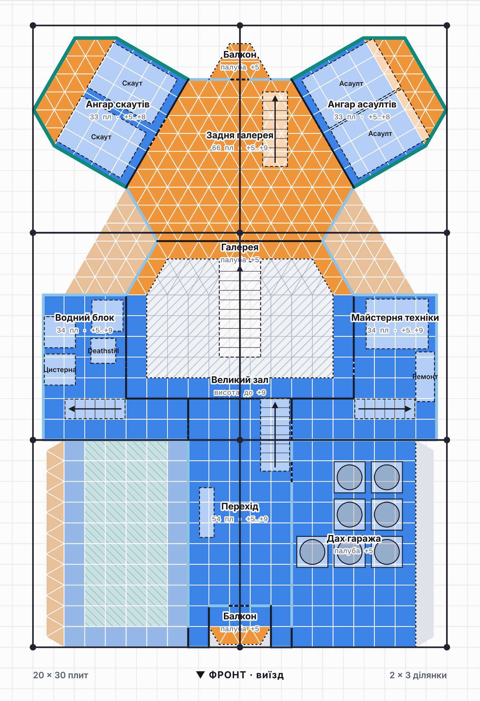

# Цитадель Харконненів — база для Dune: Awakening

Проєкт бази на **6 ділянок 10×10** з будівельних елементів Харконненів.
Використано **тільки квадратні й трикутні плити**. Повороти на 30° зроблено так само, як у грі:
квадрат → трикутник → повернутий квадрат.

Відкрий `index.html` у браузері. Там є план по рівнях у стилі скріна 1 і 3D-модель:
її можна обертати, перемикати поверхи і дивитися «лише цей поверх».

## Версія 11


Ділянки стоять сіткою **2 × 3** (20 плит завширшки, 30 углиб).

- **Перед.** Центральний заїзд 3 + 2 плити, заокруглений знизу і зверху (скрін 3), заїзди в гаражі 2 плити на рівні підлоги.
  - Гараж краулера: дах зі скошеним карнизом і пентащитом 4×9 з відступом від країв.
  - Гараж багі: дах-тераса з вітропастками.
  - Над заїздом перехід зі скошеним дахом, посередині виріз із круглим балконом.
- **Центр.** Великий зал — витягнутий шестикутник: спереду квадрати 11×5, ззаду трикутна фаска. Унизу фабрикатори (виживання, зброї, одягу), ресайклер і склад деталей; галерея на +5.
  - Впритул обабіч — прямі двоповерхові блоки (спільна стіна із залом): внизу цех меланжу (2 великі переробники спайсу) і рудний цех (3 великі + середній), нагорі водний блок і майстерня техніки.
  - Вежі починаються з +9 і стоять на дахах блоків; сходи в них — з другого поверху блоку через люк. Балкони з трьох боків, місток між вежами на +15 над переходом, як брама.
- **Тил.** За Великим залом задній зал — перевернутий шестикутник.
  - Перший поверх — головний склад (окремого складу піску немає), хімічний переробник, генератор. Обабіч одноповерхові крила складу між тилом цехів, фаскою залу і заднім залом, зовнішня стіна навскіс.
  - Задній вхід заглиблено на 2 ряди: портал урівень із задньою стороною, двері глибше, над ними навіс галереї і круглий балкон.
  - До скошених граней на +5 під кутом кріпляться ангари скаутів і асаултів (скрін). Вони звисають над обривом: під ними порожньо, знизу днище і консолі.
- **Ангар грузових** на 2 місця поруч стоїть над обома залами. Ззаду закінчується там, де задній зал звужується до 9 плит, тож над ангарами орні не нависає. Спереду розтруб і портал під містком, ззаду портал на задній майданчик. На даху ступінчаста гора (скрін 4), за нею 20 вітряків.
- **Фасади.** Кожен корпус має свій відтінок стін, ребра на кутах і стиках, пояси і карнизи.


### Рівні

| Рівень | Що там |
|---|---|
| 0 | Заїзд, гаражі, Великий зал із фабрикаторами, цех меланжу, рудний цех, головний склад із крилами, заглиблений задній вхід. Під ангарами орні — обрив |
| +5 | Перехід із круглим балконом, дах гаража багі, галерея залу, водний блок, майстерня, задня галерея, ангари орні над обривом (скло до +8, дах +8 і +9), задній балкон |
| +9 | Ангар грузових, задній майданчик, вежі (від даху блоків), дахи бічних блоків із вітропастками, дахи ангарів |
| +13 | Дах ангара грузових: гора до +16, 20 вітряків; балкони веж і місток +15, ліхтарі +17…+19,5 |



### Фундамент

Рівень 0 — один суцільний фундамент без жодної щілини. Квадрати і трикутники без залишку стикуються лише по горизонтальній лінії, тому квадратна частина (заїзд, гаражі, цехи, перед залу) і трикутна (фаска залу, задній зал, крила складу) межують тільки по горизонталі: по y = 17. `tools/check-model.js` перевіряє, що плитки лягають край у край і всередині немає дірок. У 3D режим «Тільки плити підлоги» показує самі плити вибраного поверху.

### Як ходити базою

- **Земля.** Вулиця → заїзд → гаражі → цехи → Великий зал → головний склад і крила → задній вхід.
- **З землі на +5.** Парадні сходи Великого залу, сходи на складі, сходи в обох цехах.
- **+5.** Перехід ↔ водний блок і майстерня ↔ галерея Великого залу ↔ задня галерея ↔ ангари орні ↔ задній балкон.
- **+9.** Ангар грузових: сходи із задньої галереї через люк на задній майданчик, або з переходу — вихід перед переднім порталом. Вежі: з водного блоку і майстерні через люк.
- **+15.** Вежі → балкони → місток. Вузькі сходи між грузовими → дах із вітряками.

### Пристрої на дахах

- **20 вітряків** (1×1): чотири стовпці по 5 за горою на даху ангара грузових (+13).
- **15 вітропасток** (1,5×1,5): 7 у глибині даху гаража багі (+5), по 4 на дахах бічних блоків (+9).
- Біля ангарів орні пристроїв немає.

## Розміри

- Грузовий 4×9, великий рудний переробник 3×2 заввишки до 2 — з уточнень.
- Великий переробник спайсу 3×2, 5 стін; цех меланжу має рівно 5 рівнів — впритул.
- Скаут ≈ 3,6×2,5, асаулт ≈ 4×2,7; ангари 3 рівні скла + верхній ярус даху.
- Краулер ≈ 5,5×2,6, багі 3×2, піскоцикл 2×1.
- Вітряк займає 1×1, вітропастка 1,5×1,5. Над ними нічого немає.

**Перевірити в грі:** чи проходить краулер у заїзд шириною 2 плити, чи проходить грузовий крізь горизонтальний пентащит, чи вистачає 4 рівнів ангара грузових і чи влазить переробник спайсу під стелю на 5 стін.

## Структура

| Файл | Призначення |
|---|---|
| `index.html` | Сторінка: план, 3D, легенда, кошторис плит, маршрути |
| `src/model.js` | Геометрія бази: приміщення, плитки, прорізи, сходи, обладнання. Правки дизайну вносяться сюди |
| `src/plan2d.js` | 2D-план (SVG) і підрахунок плит |
| `src/view3d.js` | 3D-модель (three.js r128) |
| `src/app.js` | Інтерфейс сторінки |
| `tools/check-model.js` | Перевірка: межі ділянок, перекриття плиток, фундамент без щілин, техніка в приміщеннях |
| `tools/render.js` | Знімки в `renders/` (Playwright) |
| `tools/build-artifact.js` | Збирає сторінку для публікації |

```sh
node tools/check-model.js
NODE_PATH=$(npm root -g) THREE_DIR=/шлях/до/node_modules/three node tools/render.js
```
