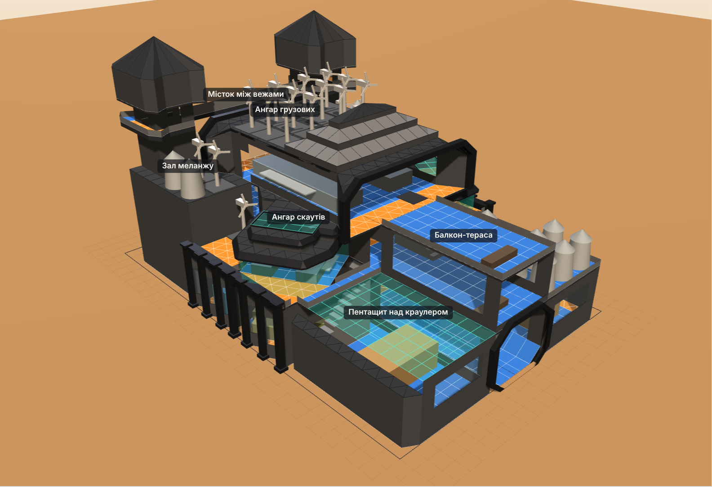
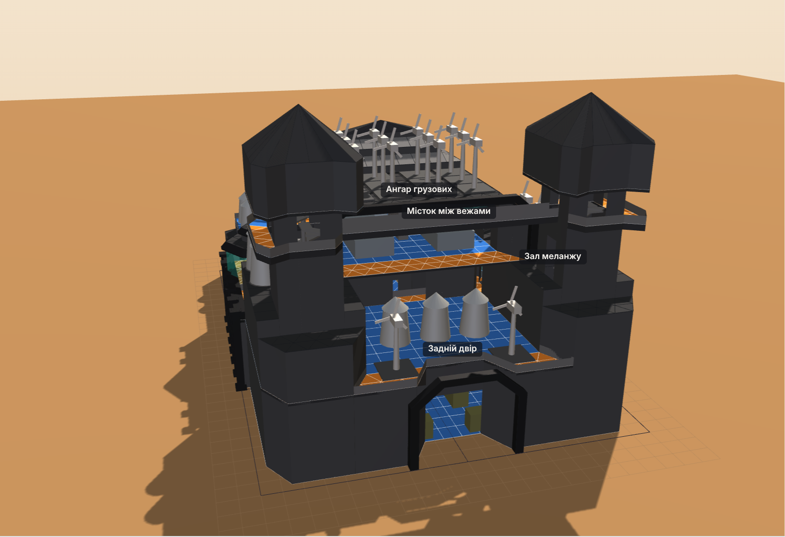
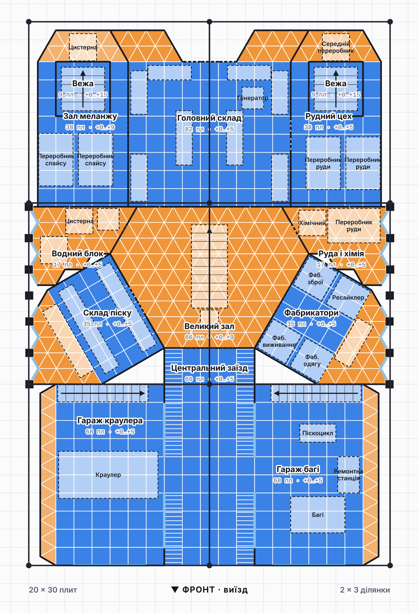
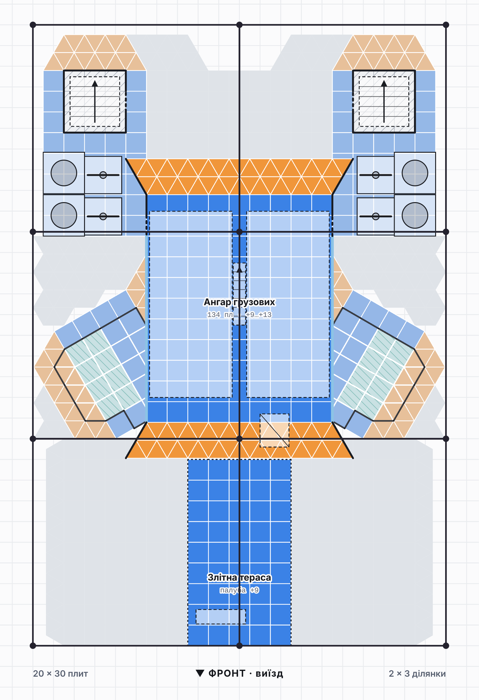

# Цитадель Харконненів — база для Dune: Awakening

Проєкт бази на **6 ділянок 10×10** з будівельних елементів Харконненів.
Використано **тільки квадратні й трикутні плити**. Повороти на 30° зроблено так само, як у грі:
квадрат → трикутник → повернутий квадрат.

Відкрий `index.html` у браузері. Там є план по рівнях у стилі скріна 1 і 3D-модель:
її можна обертати, перемикати поверхи і дивитися «лише цей поверх».

## Версія 4



Ділянки стоять сіткою **2 × 3** (20 плит завширшки, 30 углиб).

- **Ангари скаутів і асаултів** — скляні бокси з пентащитів на суцільному цоколі (скрін 1). Фронт 4 плити, закруглення по 2, рівні боки; прикріплені до Великого залу під 30°.
  Дах у 2 яруси (скрін 3): нижній +8 на весь контур зі скошеним карнизом, верхній +9 з відступом на плиту, у ньому пентащит-світлик 2×4. Виліт спереду, з боків і вгору.
- **Ангар грузових** широкий, на 2 місця поруч (9 плит), на +9…+13. Стоїть на верхньому ярусі дахів ангарів і на Великому залі. На кінцях розтруби під 60° з рамками зі зрізаними кутами (скрін 5), по боках скляна смуга.
- **Ступінчаста гора** над порталом ангара грузових на всю його ширину (скрін 4): 3 яруси зі скошеними уступами (9 → 7 → 5 плит) і пологий гребінь. Вітряки стоять рядами позаду.
- **Центральний заїзд** 3 + 2 плити, заокруглений знизу і зверху (скрін 3). Заїзди в гаражі 2 плити завширшки на рівні підлоги: похилі плити там прибрано.
- **Гараж краулера** зі стелею-пентащитом 6×9: грузовий 4×9 спускається і забирає краулер.
- **Бічні фасади.** Між гаражем і залом меланжу трикутні фундаменти дають зубчасту стіну вздовж межі ділянок. Тут вона оформлена деталями Harkonnen Stronghold: колони (Pillar) на виступах, вікна (Window) у западинах, рівний карниз зверху.
- **Задній вхід** — воронка зі скошеними укосами під порталом (скрін 2). Задні кути корпусів заокруглені трикутниками.
- **Вежі** з балконами з трьох боків на +13 і містком між ними. Грузові вилітають назад під містком.





### Рівні

| Рівень | Що там |
|---|---|
| 0 | Заїзд, гаражі, склад піску, фабрикатори, Великий зал, водний блок, руда й хімія, головний склад, зал меланжу, рудний цех, вежі, задній вхід |
| +5 | Ангари орні (скло до +8, дах +8 і +9), балкон, перехід, дах гаража багі, галерея залу, передні й задні майданчики, задній двір, майстерня техніки |
| +9 | Ангар грузових, злітна тераса, дахи корпусів, верхній ярус дахів ангарів |
| +13 | Дах ангара грузових зі ступінчастою горою до +16, балкони веж і місток; ліхтарі веж +15…+17,5 |



### Як ходити базою

- **Земля.** Вулиця → заїзд → рівні заїзди в гаражі. Заїзд → центральний вхід → Великий зал → водний блок, склад піску, фабрикатори, руда й хімія, головний склад → зал меланжу, рудний цех, вежі → задній вхід-воронка.
- **З землі на +5.** Сходи вздовж задньої стіни кожного гаража виходять на перехід і дах гаража багі. Парадні сходи залу ведуть на галерею. Вежі — з будь-якого рівня.
- **+5.** Одне кільце: перехід ↔ балкон ↔ дах гаража ↔ ангари ↔ галерея ↔ задні майданчики ↔ задній двір. Права вежа ↔ майстерня.
- **+9.** Сходи з балкона через люк ведуть в ангар грузових. Бічні двері ангара виходять урівень на дахи корпусів, звідти — двері веж. Злітна тераса урівень з ангаром.
- **+13.** Вежі → балкони → місток. Вузькі сходи між двома грузовими → дах із вітряками.

### Пристрої на дахах

- **20 вітряків:** 12 рядами за горою на даху ангара грузових (+13), 4 на дахах корпусів (+9), 2 у задньому дворі і 2 на задніх майданчиках біля залу (+5).
- **15 вітропасток:** 8 на даху гаража багі (+5), 4 на дахах корпусів (+9), 3 у задньому дворі (+5).

## Розміри

- Грузовий 4×9, великий рудний переробник 3×2 заввишки до 2 — з уточнень.
- Великий переробник спайсу 3×2, 5 стін; зал меланжу має 8 рівнів.
- Скаут ≈ 3,6×2,5, асаулт ≈ 4×2,7; ангари 3 рівні скла + верхній ярус даху.
- Краулер ≈ 5,5×2,6, багі 3×2, піскоцикл 2×1.
- Вітряк займає 1,8×1,8, вітропастка 2×2, над ними нічого немає.

**Перевірити в грі:** чи проходить краулер у заїзд шириною 2 плити, чи проходить грузовий крізь горизонтальний пентащит і чи вистачає 4 рівнів ангара грузових.

## Структура

| Файл | Призначення |
|---|---|
| `index.html` | Сторінка: план, 3D, легенда, кошторис плит, маршрути |
| `src/model.js` | Геометрія бази: приміщення, плитки, прорізи, сходи, обладнання. Правки дизайну вносяться сюди |
| `src/plan2d.js` | 2D-план (SVG) і підрахунок плит |
| `src/view3d.js` | 3D-модель (three.js r128) |
| `src/app.js` | Інтерфейс сторінки |
| `tools/check-model.js` | Перевірка: межі ділянок, перекриття плиток, техніка в приміщеннях |
| `tools/render.js` | Знімки в `renders/` (Playwright) |
| `tools/build-artifact.js` | Збирає сторінку для публікації |

```sh
node tools/check-model.js
NODE_PATH=$(npm root -g) THREE_DIR=/шлях/до/node_modules/three node tools/render.js
```
